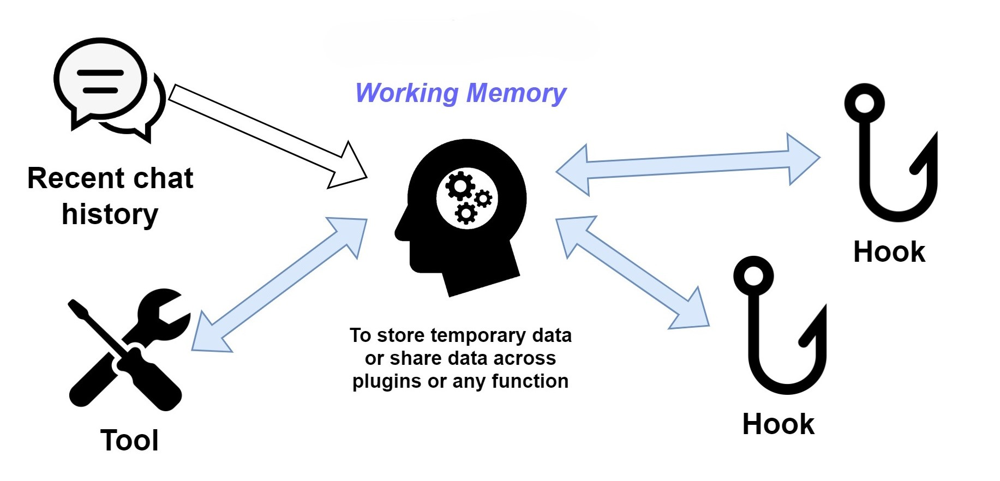

# Working Memory

## Introduction

The Working Memory is a crucial component for storing temporary data. It can be used to share data across plugins or any function that receives an instance of the Cat as an argument.

By default, the Working Memory stores the *chat history* that ends up in the [Main Prompt](../prompts/main_prompt.md).
Additionally, it collects relevant context from the *episodic*, *declarative* and
*procedural* memories in the [Long Term Memory](long_term_memory.md).

The Working Memory is essential for a state machine within your own implementation due to its dynamic nature and ability to store data across plugins and different messages within a user session. 

{width=500px style="display: block; margin: 0 auto"}

## Interacting with the Working Memory

As mentioned above, the Working Memory is a key component in the Cheshire Cat framework and can be leveraged within your own plugins.

Whenever you have a StrayCat instance, you can access the Working Memory through the `working_memory` property, like so:

```python
from cat.mad_hatter.decorators import hook

@hook
def agent_fast_reply(fast_reply, cat):
    if len(cat.working_memory.declarative_memories) == 0:
        fast_reply["output"] = "Sorry, I'm afraid I don't know the answer"

    return fast_reply
```

The `working_memory` property returns an instance of the `WorkingMemory` class, which acts as a key-value store with a dual nature. It can store data as key-value pairs like a dictionary and also benefit from Pydantic's data validation and serialization features for its default properties.

This flexibility allows you to access and set attributes using dot notation, creating and assigning arbitrary attributes on the fly. This makes the Working Memory highly adaptable for handling dynamic data structures.

## Use the Working Memory as a State Machine

One of the most powerful features of the Working Memory is its ability to function as a state machine.

Each time you send a message to the Cat, it stores useful data in the Working Memory, which can be retrieved to produce the output for the next message. This, along with the ability to store custom data throughout the session, is key to implementing your specific agent in a more programmatic way.

An example of this usage in the Cheshire Cat is the [Conversational Form](../../technical/plugins/forms.md) which provides a state machine to guide both the user and LLM in conversation and offers basic interfaces to plugin developers based on the specific state of the conversation.

### Example of the Working Memory as a State Machine

Given that the Conversational Forms state-machine implementation is quite advanced, let's create a simpler example: a troubleshooting report agent.

First of all, you need to create a new plugin. [Plugin? Is that some kind of exotic dish?](../../quickstart/prepare-plugin.md).

Once there, we need to define what are the states of the conversation. This can be done by creating a `ConversationState` class. Like so:

```python
from enum import Enum

class TroubleshootingState(Enum):
    ASK_PROBLEM = 1
    CHECK_DOCKER = 2
    CHECK_LOGS = 3
    ASK_SAVE = 4
    CLOSED = 5
```

Next, we need to create a class that will be used to track the state of the conversation and the responses given by the user.

```python

class TroubleshootingReport:
    def __init__(self):
        self.state = TroubleshootingState.ASK_PROBLEM
        self.answers = []

    def update_state(self, new_state: TroubleshootingState, answer: str):
        self.answers.append((self.state, answer))
        self.state = new_state

    def generate_report(self):
        report = f"Troubleshooting Report:\n"
        for state, answer in self.answers:
            report += f"{state.name}: {answer}\n"
        return report

```

Now, we need to build a state machine to control the conversation flow without blocking users who are not reporting a troubleshooting problem. For that we will use the [`agent_fast_reply`](../../technical/plugins/hooks.md#available-hooks) hook. The hook function checks if a troubleshooting report has been created in the current session using the Working Memory. If not, classify the user input as either troubleshooting-related or not. If it is, start tracking the report state in the Working Memory.

```python

@hook
def agent_fast_reply(fast_reply, cat):
    troubleshooting = getattr(cat.working_memory, "troubleshooting", None)
    user_message = cat.working_memory.user_message_json.text

    if troubleshooting is None:
        troubleshooting_intent = cat.classify(
            user_message, 
            labels={
                "troubleshooting_related": ["I need help with my Cat instance"],
                "not_troubleshooting_related": ["Whatever"]
            }
        )

        if troubleshooting_intent == "troubleshooting_related":
            cat.working_memory.troubleshooting = TroubleshootingReport()
            fast_reply["output"] = "What seems to be the problem with your Cat instance?"
        else:
            return fast_reply

```

Now we can write some code to control in a more granular and stateful way the flow of the conversation.

```python

# ... agent_fast_reply code

    if troubleshooting.state == TroubleshootingState.ASK_PROBLEM:
        troubleshooting.update_state(TroubleshootingState.CHECK_DOCKER, user_message)
        fast_reply["output"] = "Have you checked if the Docker Engine is running?"

    elif troubleshooting.state == TroubleshootingState.CHECK_DOCKER:
        troubleshooting.update_state(TroubleshootingState.CHECK_LOGS, user_message)
        fast_reply["output"] = "Have you checked if there are any errors in your logs?"

    elif troubleshooting.state == TroubleshootingState.CHECK_LOGS:
        troubleshooting.update_state(TroubleshootingState.ASK_SAVE, user_message)
        fast_reply["output"] = "Do you want to save your report and send it to Cheshire Cat mantainers?"

    elif troubleshooting.state == TroubleshootingState.ASK_SAVE:
        troubleshooting.update_state(TroubleshootingState.CLOSED, user_message)
        fast_reply["output"] = troubleshooting.generate_report()
        cat.working_memory.troubleshooting = None

    return fast_reply

```

As you've noticed, this state-machine is quite basic and can be easily adapted to your needs. Also, strict control flow chatbot like this are part of an old generation of chatbots. Again, for a more dynamic and stateful implementation you can use the [Conversational Forms](https://github.com/CheshireCatAI/conversational-forms). Still, you can enhance this example and provide more dynamic steps, interactions with LLMS, etc.