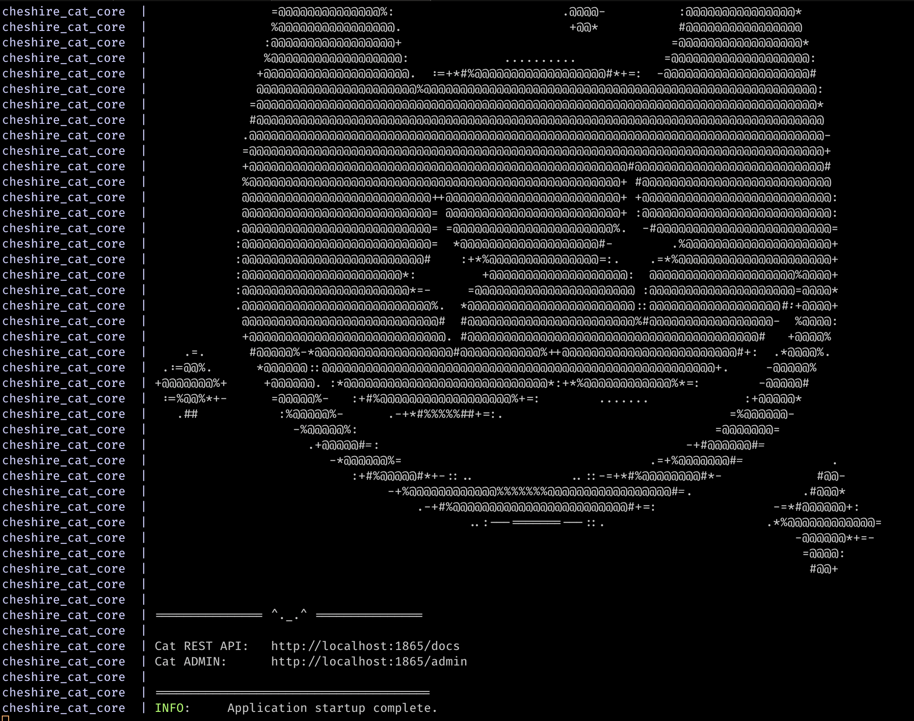
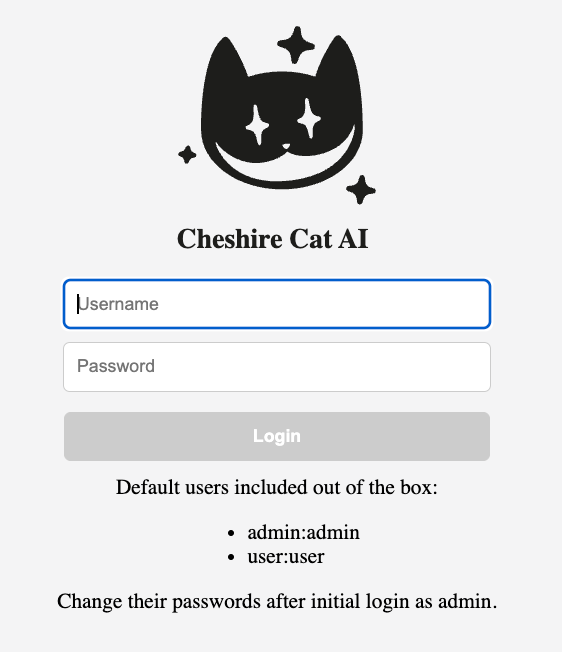
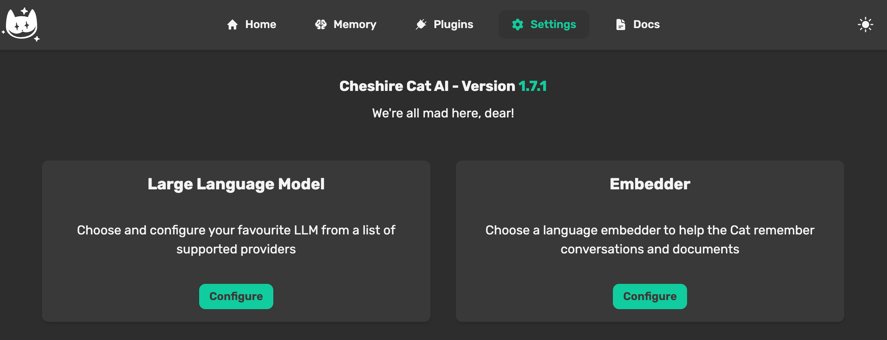

# &#128640; Installation and First configuration

## Requirements

To run the Cheshire Cat, you need to have `Docker` ([instructions](https://docs.docker.com/engine/install/)) and `docker compose` ([instructions](https://docs.docker.com/compose/install/)) already installed on your system.

The Cat is not a LLM, it uses a LLM.
Hence, when you run the Cat for the first time, you need to configure the LLM and the embedder.  
Most people use [ChatGPT](https://platform.openai.com/docs/models/gpt-3-5), it's quite cheap and powerful enough.
We will do the same during the next steps.

To use `ChatGPT`, you need an API key. You can request one on the provider's website:

- visit your OpenAI [API Keys](https://platform.openai.com/account/api-keys){:target="_blank"} page
- create an API key with `+ Create new secret key` and copy it

## Setup

Create a folder on your machine, we will use `cheshire-cat-ai`, and inside it create a file named `compose.yml`.
Copy/paste the following inside:

```yaml
services:

  cheshire-cat-core:
    image: ghcr.io/cheshire-cat-ai/core:latest
    container_name: cheshire_cat_core
    ports:
      - 1865:80
      - 5678:5678
    volumes:
      - ./static:/app/cat/static
      - ./plugins:/app/cat/plugins
      - ./data:/app/cat/data
```

## Starting the Cat
    
- Open a terminal inside the new folder and run:

```bash
docker compose up
```

The first time you run the `docker compose up` command, it will take several minutes to pull the Docker Cat image depending on network connection. Once the download is complete, the startup process will begin.

When you see the fantastic Cheshire Cat logo in terminal, it means that everything it's up and running!

{: style="height:50%;width:50%"}

Inside the new folder, you will see three newly created directories:

 - `data`: where long term memory and settings are stored
 - `plugins`: where we will install and develop plugins
 - `static`: folder to serve static files from 

These directories will retain your work even if the container is deleted.

## Stopping the Cat

Stop the terminal with `CTRL + C`.

## Starting the Cat in background

Now start again the container but in background mode, use the `--detach` or `-d` flag to the command, as:
```
docker compose up -d
```
In this way the terminal won't be locked by the docker compose execution.

To check the logs do the following:

```
docker compose logs -f
```

To stop the container, use this command in a separate terminal session:

```
docker compose down
```

## First configuration of the LLM

- Start the Cat if it's stopped
- Open the `Admin Portal` in your browser at [`localhost:1865/admin`](http://localhost:1865/admin){:target="_blank"}
- Authenticate as administrator with user and password `admin`:
{: style="height:50%;width:50%"}
- In the `Settings` tab configure the `Large Language Model` and the `Embedder` and paste your API key:  
{: style="height:50%;width:50%"}  
 [video here](../assets/vid/setup.mp4)

## Next step
In the [next step](./play-with-the-cat.md), you will learn how to play with the Cat.